# CodeMorph — Application Architecture

```mermaid
graph TB
    %% ─────────────────────────────────────────
    %% FRONTEND
    %% ─────────────────────────────────────────
    subgraph FE["Frontend  (React + Vite + MUI)"]
        direction TB
        FE_APP["App.tsx\nRouter"]
        FE_DASH["Dashboard.tsx\nProject list + create"]
        FE_DETAIL["ProjectDetail.tsx\nPipeline stepper + tabs"]
        FE_VAL["ValidationDashboard.tsx\nAudit report + metrics"]
        FE_API_C["APIAnalysis.tsx"]
        FE_DB_C["DatabaseAnalysis.tsx"]
        FE_API["api.ts\nfetch wrapper + types"]

        FE_APP --> FE_DASH
        FE_APP --> FE_DETAIL
        FE_DETAIL --> FE_VAL
        FE_DETAIL --> FE_API_C
        FE_DETAIL --> FE_DB_C
        FE_DASH --> FE_API
        FE_DETAIL --> FE_API
        FE_VAL --> FE_API
    end

    %% ─────────────────────────────────────────
    %% API LAYER
    %% ─────────────────────────────────────────
    subgraph API["FastAPI  (main.py)"]
        direction TB
        R_PROJ["projects.py\nCRUD /api/projects"]
        R_PIPE["pipeline.py\n/start /status /select-stack\n/restart-from/:stage"]
        R_ENH["enhanced_analysis.py\n/audit /validation/*\n/api-analysis /database-analysis"]
        R_ART["artifacts.py\n/artifacts  ZIP download"]
        R_REP["reports.py\n/report/legacy\n/report/migration"]
    end

    %% ─────────────────────────────────────────
    %% PIPELINE STAGES (in-memory orchestration)
    %% ─────────────────────────────────────────
    subgraph PIPE["Pipeline Stages  (_run_pipeline / _run_transformation)"]
        direction LR
        S1["1 · Ingesting\ningest_codebase()"]
        S2["2 · Parsing\nparse_files()"]
        S3["3 · Context Building\nbuild_context()\nbuild_vector_store()"]
        S4["4 · Agentic Analysis\nCodeMorphOrchestrator"]
        S5["5 · Selecting\n(user pauses here)"]
        S6["6 · Transforming\ntransform_codebase()"]
        S7["7 · Post-Transform Analysis\n_run_post_transformation_analysis()"]
        S8["8 · Complete"]

        S1 --> S2 --> S3 --> S4 --> S5 --> S6 --> S7 --> S8
    end

    %% ─────────────────────────────────────────
    %% SERVICES
    %% ─────────────────────────────────────────
    subgraph SVC["Services"]
        direction TB
        SVC_ING["ingestion.py\nFile walker + language detect"]
        SVC_PAR["parser.py\nAST parser per language"]
        SVC_CTX["context_builder.py\nLayer classifier + dep graph"]
        SVC_ANA["analyzer.py\nAPI + table + pattern detect"]
        SVC_STK["stack_detector.py\nTech stack fingerprinting"]
        SVC_REC["recommender.py\nModernisation suggestions"]
        SVC_TRF["transformer.py\nAzure OpenAI file rewrite\n+ pass-through fallback"]
        SVC_TST["test_generator.py\nPytest / JUnit / Jest stubs"]
        SVC_RPT["report_generator.py\nPDF via ReportLab"]
        SVC_BUS["business_analyzer.py"]
        SVC_CHK["enhanced_chunking.py"]
        SVC_CNF["confidence_scoring.py\nWeighted category scores"]
        SVC_BEH["behavioral_validation.py\n6 validators + HumanReviewGate"]
        SVC_DBA["database_analyzer.py\nSchema + ORM model gen"]
        SVC_APC["api_converter.py\nEndpoint extraction + OpenAPI"]
    end

    %% ─────────────────────────────────────────
    %% AGENTIC LAYER
    %% ─────────────────────────────────────────
    subgraph AGT["Agentic Layer  (LangGraph)"]
        direction TB
        ORC["CodeMorphOrchestrator\nLangGraph StateGraph"]
        AGT_ANA["AnalysisAgent\nAST · Complexity · Security\nDependency · Pattern tools"]
        AGT_CTX["ContextAgent\nLayer classify · Cross-cutting\nDependency map tools"]
        AGT_BASE["BaseCodeMorphAgent\nAzureChatOpenAI + tool binding"]

        ORC --> AGT_ANA
        ORC --> AGT_CTX
        AGT_ANA --> AGT_BASE
        AGT_CTX --> AGT_BASE
    end

    %% ─────────────────────────────────────────
    %% AGENT TOOLS
    %% ─────────────────────────────────────────
    subgraph TOOLS["Agent Tools"]
        direction TB
        T1["code_analysis_tools.py\nASTAnalysis · Complexity\nDependencyGraph · Pattern\nSecurity"]
        T2["dependency_graph_tools.py"]
        T3["advanced_pattern_detection.py"]
    end

    %% ─────────────────────────────────────────
    %% EMBEDDINGS / RAG
    %% ─────────────────────────────────────────
    subgraph EMB["Embeddings + RAG"]
        direction TB
        EMB_E["embedder.py\nBAAI/bge-small-en\nSentenceTransformer"]
        EMB_VS["vector_store.py\nFAISS IndexFlatIP\nsave/load to disk"]

        EMB_E --> EMB_VS
    end

    %% ─────────────────────────────────────────
    %% DATABASE
    %% ─────────────────────────────────────────
    subgraph DB["SQLite  (SQLAlchemy)"]
        direction TB
        DB_PROJ["projects"]
        DB_RUN["pipeline_runs"]
        DB_AR["analysis_results\n(JSON blobs per result_type)"]
        DB_PF["parsed_files\n(original codebase AST + content)"]
        DB_TF["transformed_files\n(converted code + metrics)"]
        DB_CE["context_elements"]
        DB_VR["validation_results"]
        DB_RR["review_requests"]
        DB_DBA["database_analysis_results"]
        DB_APA["api_analysis_results"]

        DB_PROJ --> DB_RUN
        DB_PROJ --> DB_AR
        DB_PROJ --> DB_PF
        DB_PROJ --> DB_TF
        DB_PROJ --> DB_CE
        DB_PROJ --> DB_VR
        DB_PROJ --> DB_RR
        DB_PROJ --> DB_DBA
        DB_PROJ --> DB_APA
    end

    %% ─────────────────────────────────────────
    %% EXTERNAL SERVICES
    %% ─────────────────────────────────────────
    subgraph EXT["External Services"]
        AZ["Azure OpenAI\ngpt-4 / gpt-4o\nCode transformation\n+ agentic analysis"]
        HF["HuggingFace\nBAAI/bge-small-en\nLocal embeddings"]
    end

    %% ─────────────────────────────────────────
    %% CONNECTIONS
    %% ─────────────────────────────────────────

    %% Frontend ↔ API
    FE_API -->|"HTTP REST"| R_PROJ
    FE_API -->|"HTTP REST"| R_PIPE
    FE_API -->|"HTTP REST"| R_ENH
    FE_API -->|"HTTP REST"| R_ART
    FE_API -->|"HTTP REST"| R_REP

    %% API → Pipeline
    R_PIPE -->|"asyncio.create_task"| PIPE

    %% Pipeline → Services
    S1 --> SVC_ING
    S2 --> SVC_PAR
    S3 --> SVC_CTX
    S3 --> EMB
    S4 --> ORC
    S6 --> SVC_TRF
    S6 --> SVC_TST
    S7 --> SVC_ANA
    S7 --> SVC_BEH

    %% Pipeline → DB (writes)
    S1 -->|"analysis_results"| DB_AR
    S2 -->|"parsed_files"| DB_PF
    S3 -->|"context_elements"| DB_CE
    S4 -->|"analysis_results"| DB_AR
    S6 -->|"transformed_files"| DB_TF
    S7 -->|"validation_results"| DB_VR

    %% Services → DB
    SVC_BEH -->|"validation_results"| DB_VR
    SVC_DBA -->|"database_analysis_results"| DB_DBA
    SVC_APC -->|"api_analysis_results"| DB_APA

    %% Agentic layer → Services
    ORC --> SVC_CNF
    ORC --> SVC_BEH
    ORC --> SVC_DBA
    ORC --> SVC_APC
    AGT_ANA --> TOOLS
    AGT_CTX --> TOOLS

    %% Enhanced analysis API → DB (reads)
    R_ENH -->|"reads"| DB_VR
    R_ENH -->|"reads"| DB_TF
    R_ENH -->|"reads"| DB_PF
    R_ENH -->|"reads"| DB_AR
    R_ENH -->|"reads"| DB_CE

    %% Reports → Services
    R_REP --> SVC_RPT

    %% External
    SVC_TRF -->|"async completions"| AZ
    AGT_BASE -->|"AzureChatOpenAI"| AZ
    EMB_E -->|"local inference"| HF

    %% RAG retrieval during transform
    EMB_VS -->|"similarity search"| SVC_TRF
```

## Layer Summary

| Layer | Technology | Responsibility |
|---|---|---|
| Frontend | React 18, Vite, MUI, TanStack Query | UI, pipeline stepper, audit dashboard |
| API | FastAPI, Pydantic | REST endpoints, background task dispatch |
| Pipeline | asyncio tasks, in-memory `_pipeline_data` | Stage orchestration, progress tracking |
| Services | Pure Python | Ingestion, parsing, analysis, transformation, validation, reporting |
| Agentic | LangGraph, LangChain, AzureChatOpenAI | AI-driven analysis, confidence scoring, human review gate |
| Embeddings | FAISS, sentence-transformers (BAAI/bge-small-en) | RAG context retrieval during transformation |
| Database | SQLite via SQLAlchemy | Persistent storage for all pipeline artefacts and results |
| External | Azure OpenAI, HuggingFace | LLM code transformation + local embeddings |

## Key Data Flows

1. **Analysis flow** — `Ingest → Parse → Context → Agentic Analysis → Selecting` (pauses for user stack choice)
2. **Transformation flow** — `Transforming (Azure OpenAI) → persist TransformedFile rows → Auto API analysis → Post-transform validation`
3. **Validation flow** — `BehavioralValidationEngine` runs 6 validators against `TransformedFile` DB rows; results stored in `validation_results`
4. **Audit flow** — `GET /audit/:id` aggregates `ParsedFile`, `TransformedFile`, `ValidationResult`, `ContextElement`, and `AnalysisResult` rows into a single audit report consumed by the frontend
5. **RAG flow** — File chunks embedded via BAAI/bge-small-en → FAISS index → retrieved as context during per-file LLM transformation
