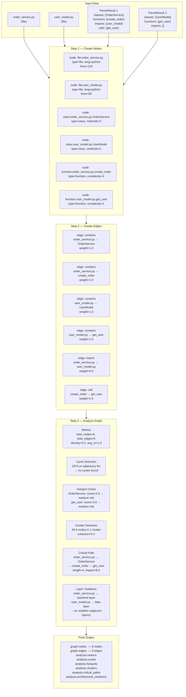

# Dependency Graph — How It Works

## What Is It?

The dependency graph is a **multi-level structural map of the codebase** being analyzed. It answers questions like:
- Which files import which other files?
- Which classes inherit from which parents?
- Which functions call which other functions?
- Are there circular dependencies?
- Which components are architectural hotspots?

It is not a runtime call graph — it is a **static analysis graph** built from source code parsing.

---

## Two Implementations

### 1. `DependencyGraphTool` — `code_analysis_tools.py`

The simpler, file-level tool. Used directly by the `AnalysisAgent`.

- Extracts `import` / `require` statements from Python, Java, JavaScript, TypeScript
- Builds nodes (one per file) and edges (one per import relationship)
- Resolves import strings to actual file paths where possible
- Detects circular dependencies via DFS
- Calculates basic metrics: density, average degree, total nodes/edges

### 2. `EnhancedDependencyGraphTool` — `dependency_graph_tools.py`

The full-featured tool. Used by the `Orchestrator` for the final merged graph.

Nodes represent three levels:
| Node Type | What It Represents |
|-----------|-------------------|
| `file` | A source file (path, language, LOC, size) |
| `class` | A class inside a file (methods, parent classes, interfaces) |
| `function` | A function inside a file (params, return type, complexity) |

Edges represent four relationship types:
| Edge Type | Meaning | Weight |
|-----------|---------|--------|
| `contains` | File → Class or File → Function | 1.0 |
| `import` | File → File (import/require) | 0.5 |
| `call` | Function → Function (invocation) | 1.0 |
| `inheritance` | Class → Parent Class | 2.0 |

---

## How the Graph Is Built — Step by Step

```
1. Ingestion
   Files are uploaded and stored with path, language, raw content

2. Parsing (parser.py)
   Each file is parsed to extract:
   - classes, functions, imports, exports
   - AST data, complexity scores

3. Context Building (context_builder.py → build_context())
   - Classifies files into architecture layers
     (frontend / backend / database / integration / deployment)
   - Builds a simple dependency_graph: { ComponentName: [import_strings] }
   - Produces a service_map and component list

4. Agentic Analysis (AnalysisAgent + ContextAgent)
   - AnalysisAgent runs DependencyGraphTool on the files
   - ContextAgent analyzes dependencies_and_relationships from context
   - Both agents return their dependency findings independently

5. Orchestrator Merge (_build_enhanced_dependency_graph)
   - Combines context_deps (from ContextAgent) + analysis_deps (from AnalysisAgent)
   - Adds file nodes for every ingested file
   - Adds import edges from the context imports map
   - Adds circular dependency edges explicitly
   - Groups nodes into clusters by top-level directory
   - Calculates final metrics

6. Confidence Scoring
   - _calculate_dependency_confidence() scores the graph
   - Stored in state["confidence_scores"]["dependencies"]

7. Storage
   - Saved as JSON in the analysis_results table
   - result_type = "agentic_analysis"
   - Linked to the project via project_id

8. API Exposure
   - GET /audit/{project_id} aggregates and returns dependency data
   - GET /validation/results/{project_id} includes dependency_health validation
```

---

## Graph Analysis Capabilities

Once built, the `EnhancedDependencyGraphTool` runs these analyses:

### Cycle Detection
DFS-based cycle finder. Classifies cycles as:
- `file_cycle` — circular imports between files
- `class_cycle` — circular class references
- `function_cycle` — circular function calls
- `mixed_cycle` — spans multiple node types

### Hotspot Identification
Scores each node by centrality:
```
hotspot_score = (in_degree × 2 + out_degree) / 3
```
Risk levels: `critical` (>10), `high` (>5), `medium` (>2), `low`

### Cluster Detection
Finds groups of highly connected components using undirected connected-components DFS. Calculates cohesion (ratio of internal edges to max possible internal edges).

### Critical Path Analysis
Finds the longest dependency chains starting from entry points (nodes with no incoming edges). Scores each path by length and node types.

### Architectural Violation Detection
Classifies nodes into layers by file path keywords:

| Layer | Keywords |
|-------|----------|
| presentation | ui, view, controller, frontend |
| business | service, logic, domain, business |
| data | repository, dao, model, entity, database |
| infrastructure | config, util, helper, infrastructure |

Flags edges where a higher layer skips directly to a lower layer (e.g., presentation → data without going through business).

---

## How Other Parts of the App Use It

### `BehavioralValidationEngine`
Runs a `dependency_health` validator against the graph. Checks for circular dependencies and layer compliance. Contributes to the overall validation score.

### `ContextElement` (database model)
Each component stored in `context_elements` has:
- `dependencies` — list of things it depends on
- `dependents` — list of things that depend on it
- `layer` — its architectural layer classification

These are populated from the dependency graph and used in audit report generation.

### `CodeMorphOrchestrator`
The orchestrator is the central consumer. It:
1. Runs both agents in parallel
2. Merges their dependency outputs
3. Stores the final graph in `state["dependency_graph"]`
4. Uses it to calculate a confidence score for the overall analysis

### API Layer
The `/audit/{project_id}` endpoint aggregates `ContextElement` records and `AnalysisResult` records to return dependency data including detected stack, validator scores, and evidence.

---

## Summary

The dependency graph connects the dots between the raw code and the higher-level analysis. It is built in layers — first a simple import map from the context builder, then enriched with class/function-level relationships by the enhanced tool, then merged and scored by the orchestrator. Every downstream feature (validation, audit reports, recommendations) draws from this graph to understand how the codebase is structured and where its risks are.

---

## Sample Diagram — How the Enhanced Dependency Graph Is Built

The diagram below shows a sample project with two files (`order_service.py` and `user_model.py`), tracing every step from raw input through to the final analyzed graph.



### Reading the Diagram

| Step | What Happens |
|------|-------------|
| Input | Raw file content + parse results (classes, functions, imports, calls) are passed in as JSON |
| Step 1 — Nodes | One node per file, one per class, one per function — each with its own metadata |
| Step 2 — Edges | `contains` edges link files to their classes/functions; `import` edges link files; `call` edges link functions; `inheritance` edges link classes to parents |
| Step 3 — Analysis | The completed node/edge graph is passed through 6 analysis passes (metrics, cycles, hotspots, clusters, critical paths, layer violations) |
| Output | A single JSON object with `graph` + `analysis` returned by `_run()` |

---

## Where the Input Comes From — Full Pipeline Trace

The `EnhancedDependencyGraphTool` does not get called in isolation. Its input is assembled across four pipeline stages before it ever runs.

### Stage 1 — Ingestion (`ingestion.py → ingest_codebase()`)

Triggered by `POST /api/pipeline/{project_id}/start`. The pipeline walks the project directory (or clones a Git URL), skips binary files and noise dirs (`node_modules`, `target`, `__pycache__`, etc.), and produces a list of file dicts:

```python
{
  "path": "src/main/java/com/university/ejb/service/CourseServiceBean.java",
  "language": "Java",       # detected from extension
  "loc": 142,
  "size": 4821,
  "extension": ".java",
  "content": "package com.university..."   # full raw text
}
```

This list is stored in `_pipeline_data[project_id]["files"]` and passed forward.

### Stage 2 — Parsing (`parser.py → parse_files()`)

Each file dict is run through `parse_file()`. For Java files the parser applies `JAVA_PATTERNS` regexes (and tree-sitter if available) to extract:

| Field | What it captures |
|-------|-----------------|
| `classes` | class/interface names, parent classes, annotations |
| `functions` | method signatures, visibility, return types |
| `imports` | fully-qualified import statements |
| `annotations` | `@Entity`, `@Stateless`, `@RestController`, etc. |
| `framework_patterns` | detected frameworks (Spring, EJB, JPA, etc.) |
| `endpoints` | `@GetMapping`, `@RequestMapping` paths |

The result is a `parse_result` dict aligned 1-to-1 with the files list.

### Stage 3 — Context Building (`context_builder.py → build_context()`)

`build_context(parse_results, files)` runs over all parse results and produces:
- `dependencies`: `{ ClassName: [import_strings] }` — the simple import map
- `layers`: files classified into frontend / backend / database / integration / deployment
- `components`: flat list of all classes with their layer assignment

This is stored as `context_results["dependencies_and_relationships"]` in the orchestrator state.

### Stage 3.5 — Agentic Analysis (`orchestrator.py`)

The orchestrator receives `files` + `project_context` (which includes `parse_results` and `context`) and runs a LangGraph state machine. The dependency graph is built in `_run_dependency_analysis()`:

```python
context_deps  = state["context_results"]["dependencies_and_relationships"]
analysis_deps = state["analysis_results"]["dependencies"]

dependency_graph = self._build_enhanced_dependency_graph(
    context_deps, analysis_deps, state["input_data"]["files"]
)
```

`_build_enhanced_dependency_graph()` is what actually calls the logic described in the diagram above — it merges both dependency sources, creates nodes for every file, adds import and circular-dependency edges, and clusters nodes by top-level directory.

The `EnhancedDependencyGraphTool` itself is invoked by the `AnalysisAgent` as one of its five tools during `_run_code_analysis()`, and its output feeds into `analysis_deps`.

### Input Data Shape Entering the Enhanced Tool

```python
# JSON string passed to EnhancedDependencyGraphTool._run()
{
  "files": [
    { "path": "...", "language": "Java", "content": "...", "loc": 142 },
    ...
  ],
  "parse_results": [
    {
      "classes":   [{ "name": "CourseServiceBean", "parent_classes": [], "methods": [...] }],
      "functions": [{ "name": "getCourse", "parameters": [...], "return_type": "Course" }],
      "imports":   ["com.university.model.Course", "javax.ejb.Stateless"],
      "function_calls": [{ "name": "findById", "caller": "getCourse" }]
    },
    ...
  ]
}
```

---

## Java Example — Dependency Graph for a JEE EJB Project

Using the actual `Colruyt_Sample` files in this workspace (`CourseServiceBean.java`, `EnrollmentServiceBean.java`, etc.) as a concrete example.

```mermaid
flowchart TD
    subgraph INPUT["Input — After Parsing"]
        J1["CourseServiceBean.java\nlanguage=Java, loc=142"]
        J2["EnrollmentServiceBean.java\nlanguage=Java, loc=98"]
        J3["ExamServiceBean.java\nlanguage=Java, loc=87"]

        PR1["ParseResult: CourseServiceBean\nclasses: [CourseServiceBean]\nmethods: [getCourse, createCourse, deleteCourse]\nimports: [com.university.model.Course,\n  javax.ejb.Stateless,\n  javax.persistence.EntityManager]\nannotations: [@Stateless, @Entity]"]

        PR2["ParseResult: EnrollmentServiceBean\nclasses: [EnrollmentServiceBean]\nmethods: [enroll, getEnrollments]\nimports: [com.university.model.Course,\n  com.university.model.Student,\n  javax.ejb.Stateless]\nannotations: [@Stateless]"]

        PR3["ParseResult: ExamServiceBean\nclasses: [ExamServiceBean]\nmethods: [scheduleExam, getResults]\nimports: [com.university.model.Course,\n  javax.ejb.Stateless]\nannotations: [@Stateless]"]
    end

    subgraph NODES["Step 1 — Node Creation"]
        NF1["node: file:CourseServiceBean.java\ntype=file, lang=Java"]
        NF2["node: file:EnrollmentServiceBean.java\ntype=file, lang=Java"]
        NF3["node: file:ExamServiceBean.java\ntype=file, lang=Java"]

        NC1["node: class:CourseServiceBean.java:CourseServiceBean\ntype=class, methods=3\nparent_classes=[]"]
        NC2["node: class:EnrollmentServiceBean.java:EnrollmentServiceBean\ntype=class, methods=2"]
        NC3["node: class:ExamServiceBean.java:ExamServiceBean\ntype=class, methods=2"]

        NM1["node: function:CourseServiceBean.java:getCourse\ntype=function, complexity=2"]
        NM2["node: function:CourseServiceBean.java:createCourse\ntype=function, complexity=3"]
        NM3["node: function:EnrollmentServiceBean.java:enroll\ntype=function, complexity=4"]
        NM4["node: function:ExamServiceBean.java:scheduleExam\ntype=function, complexity=3"]
    end

    subgraph EDGES["Step 2 — Edge Creation"]
        E1["contains\nCourseServiceBean.java → CourseServiceBean\nweight=1.0"]
        E2["contains\nCourseServiceBean.java → getCourse\nweight=1.0"]
        E3["contains\nCourseServiceBean.java → createCourse\nweight=1.0"]
        E4["contains\nEnrollmentServiceBean.java → EnrollmentServiceBean\nweight=1.0"]
        E5["contains\nEnrollmentServiceBean.java → enroll\nweight=1.0"]
        E6["contains\nExamServiceBean.java → ExamServiceBean\nweight=1.0"]
        E7["contains\nExamServiceBean.java → scheduleExam\nweight=1.0"]

        E8["import\nEnrollmentServiceBean.java → CourseServiceBean.java\n(via com.university.model.Course)\nweight=0.5"]
        E9["import\nExamServiceBean.java → CourseServiceBean.java\n(via com.university.model.Course)\nweight=0.5"]
    end

    subgraph ANALYSIS["Step 3 — Graph Analysis"]
        A1["Metrics\nnodes=10, edges=9\ndensity=0.1\navg_in_degree=0.9, avg_out_degree=0.9"]

        A2["Cycle Detection\nDFS traversal\n→ no cycles detected\n(EJBs are stateless, no back-references)"]

        A3["Hotspot Identification\nCourseServiceBean.java\n  in_degree=2 (imported by Enrollment + Exam)\n  out_degree=0\n  score = (2×2 + 0)/3 = 1.33 → low risk\n\nEnrollmentServiceBean.java\n  score = 0.67 → low risk"]

        A4["Cluster Detection\nAll 10 nodes form 1 cluster\n(all connected via CourseServiceBean)\ncohesion = 9/90 = 0.1"]

        A5["Critical Path\nEntry: EnrollmentServiceBean.java\nPath: EnrollmentServiceBean.java\n  → CourseServiceBean.java\n  → CourseServiceBean (class)\n  → getCourse (function)\nlength=4, impact=9.5"]

        A6["Architectural Layer Check\nAll files match 'service' keyword\n→ classified as business layer\n→ no cross-layer violations detected"]
    end

    subgraph OUTPUT["Final Output JSON"]
        OUT["graph.nodes  — 10 nodes\ngraph.edges  — 9 edges\n\nanalysis.metrics.density = 0.1\nanalysis.cycles = []\nanalysis.hotspots = [\n  { node: CourseServiceBean.java,\n    in_degree: 2, risk: low }\n]\nanalysis.clusters = [\n  { size: 10, cohesion: 0.1 }\n]\nanalysis.critical_paths = [\n  { length: 4, impact: 9.5 }\n]\nanalysis.architectural_violations = []"]
    end

    J1 & J2 & J3 --> NODES
    PR1 & PR2 & PR3 --> NODES
    NODES --> EDGES
    EDGES --> ANALYSIS
    ANALYSIS --> OUTPUT
```



### What This Tells the System About the Java Project

| Finding | Value | Meaning |
|---------|-------|---------|
| `CourseServiceBean.java` in_degree = 2 | Both other EJBs import it | It is a shared dependency — changes here ripple to Enrollment and Exam |
| No cycles | Clean | No circular EJB references, safe to refactor independently |
| All nodes in one cluster | Cohesion = 0.1 | Loosely connected — good for microservice extraction |
| No architectural violations | All in `business` layer | Layer boundaries are respected |
| Critical path length = 4 | Enrollment → Course → class → method | The longest chain to trace when debugging an enrollment issue |

This output is then stored in `analysis_results` (DB), consumed by the `BehavioralValidationEngine` for dependency health scoring, and surfaced via the `/audit/{project_id}` endpoint.
