# CodeMorph — Graph Builds: Visual Technical Reference

CodeMorph constructs **three distinct graphs** during its pipeline. Each is a genuine graph — a set of vertices (V) and directed edges (E) — but each serves a different purpose, uses different construction techniques, and is stored differently.

---

## Graph 1 — LangGraph Orchestration Graph

**What:** Directed control-flow graph of computation steps (not the codebase).
**Library:** `langgraph` — Pregel-style message-passing executor.
**Built once** at orchestrator init; executed per analysis run via `graph.ainvoke()`.

### Visual — Full Graph

```mermaid
flowchart TD
    START(["▶ START\nainvoke(initial_state)"])

    N1["🔷 initialize\n_initialize_state()\nValidate files · set start_time\nrecord languages"]
    N2["🔷 context_analysis\n_run_context_analysis()\nContextAgent: layer classify\ncross-cutting · import map"]
    N3["🔷 code_analysis\n_run_code_analysis()\nAnalysisAgent: AST · complexity\nsecurity · patterns"]
    N4["🔷 dependency_analysis\n_run_dependency_analysis()\nBuild file/class/function graph\ncalculate dep confidence"]
    N5["🔷 database_analyzer\n_run_database_analysis()\nDatabaseAnalyzer: schema\nORM model generation"]
    N6["🔷 api_analyzer\n_run_api_analysis()\nAPIConverter: endpoints\nOpenAPI spec"]
    N7["🔷 confidence_scoring\n_calculate_confidence_scores()\nConfidenceScoringEngine\n7 categories · weighted avg"]
    N8["🔷 generate_recommendations\n_generate_recommendations()\nArchitecture · Security\nPerformance · Modernisation"]

    COND{"🔀 _should_require_human_review()\noverall_confidence < 0.7 ?\nsecurity_confidence < 0.5 ?\nerrors present ?"}

    N9["🔶 human_review_gate\n_human_review_gate()\nCheck confidence threshold\nFlag for review if below"]
    N10["🔷 validation\n_validate_results()\nCompleteness · Consistency\nConfidence levels"]
    N11["🔷 finalize\n_finalize_results()\nAssemble final summary\nRecord execution time"]
    STOP(["⏹ END"])

    START --> N1
    N1 -->|"add_edge"| N2
    N2 -->|"add_edge"| N3
    N3 -->|"add_edge"| N4
    N4 -->|"add_edge"| N5
    N5 -->|"add_edge"| N6
    N6 -->|"add_edge"| N7
    N7 -->|"add_edge"| N8
    N8 --> COND
    COND -->|"'human_review'"| N9
    COND -->|"'validation'"| N10
    N9 -->|"add_edge"| N10
    N10 -->|"add_edge"| N11
    N11 -->|"add_edge"| STOP

    classDef node fill:#1e3a5f,color:#fff,stroke:#4a90d9,stroke-width:2px
    classDef cond fill:#3d2a00,color:#fff,stroke:#fbbf24,stroke-width:2px
    classDef gate fill:#3b1f00,color:#fff,stroke:#fb923c,stroke-width:2px
    classDef se fill:#1a1a2e,color:#fff,stroke:#818cf8,stroke-width:2px
    class N1,N2,N3,N4,N5,N6,N7,N8,N10,N11 node
    class COND cond
    class N9 gate
    class START,STOP se
```

### Visual — AgentState flowing through nodes

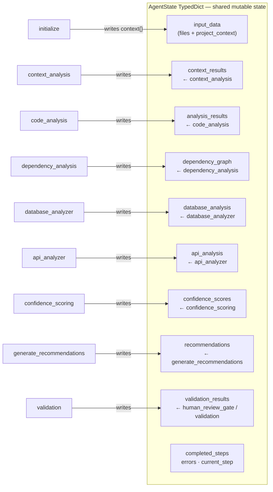

### Visual — Adjacency representation

```mermaid
graph LR
    I["initialize"] --> CA["context_analysis"]
    CA --> COA["code_analysis"]
    COA --> DA["dependency_analysis"]
    DA --> DBA["database_analyzer"]
    DBA --> AA["api_analyzer"]
    AA --> CS["confidence_scoring"]
    CS --> GR["generate_recommendations"]
    GR -->|"confidence OK"| V["validation"]
    GR -->|"confidence LOW"| HRG["human_review_gate"]
    HRG --> V
    V --> F["finalize"]
    F --> END(["END"])

    style GR fill:#3d2a00,color:#fff,stroke:#fbbf24
    style HRG fill:#3b1f00,color:#fff,stroke:#fb923c
```

---

## Graph 2 — Enhanced Dependency Graph

**What:** Directed, weighted, multi-type property graph of the codebase itself.
**Library:** Pure Python — `collections.defaultdict`, custom `@dataclass` objects, plain `dict`/`list`.
**Built** inside the `dependency_analysis` node of Graph 1.

### Visual — Node types and edge types

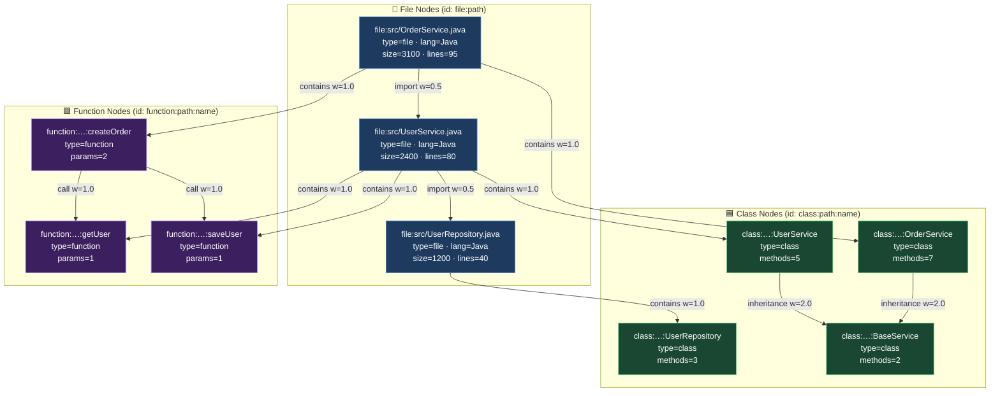

### Visual — Edge weight legend

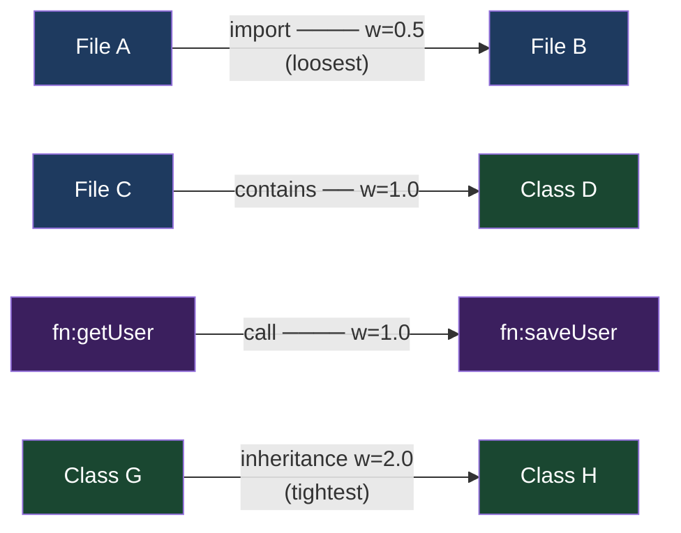

### Visual — Cycle Detection Algorithm (DFS + recursion stack)

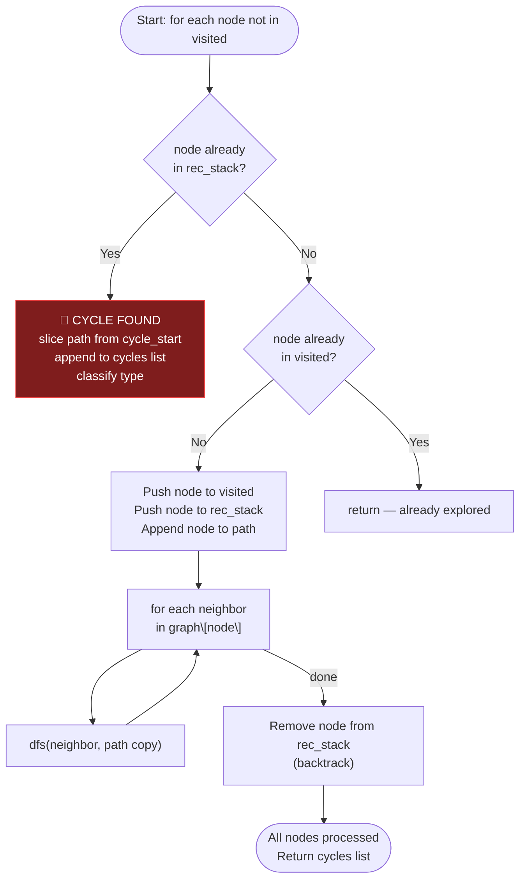

### Visual — Example cycle detected

> Cycle path: `[OrderService → UserService → PaymentService → OrderService]`
> Type: `file_cycle` · Length: 3

### Visual — Cluster Detection (undirected flood-fill)

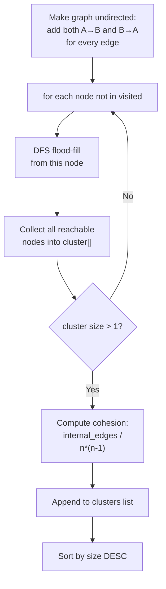

### Visual — Example clusters

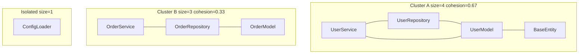

### Visual — Hotspot Identification

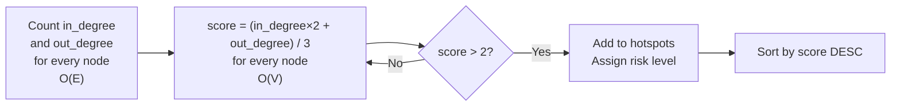

### Visual — Example hotspot graph

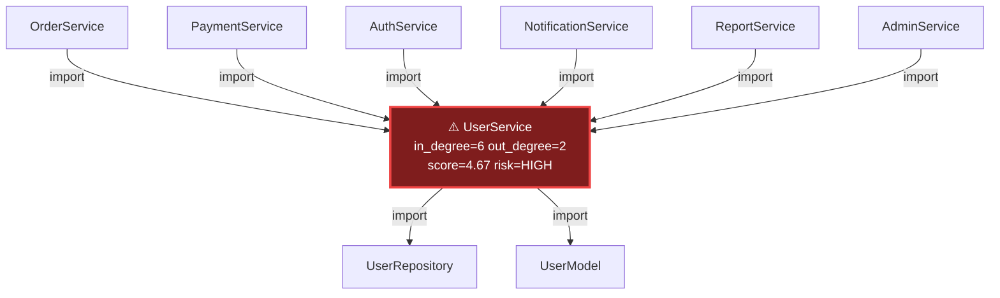

### Visual — Architectural Violation Detection

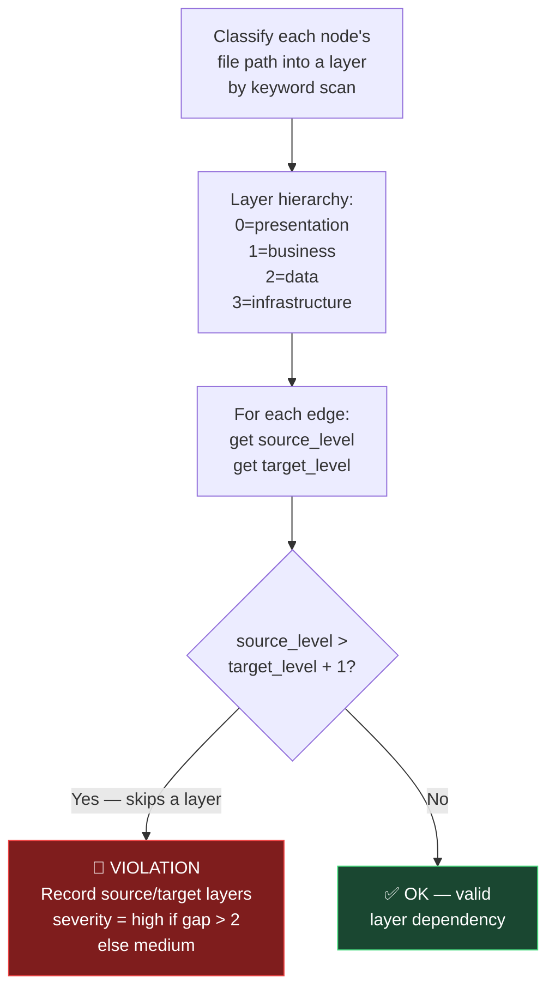

### Visual — Example valid vs violated dependencies

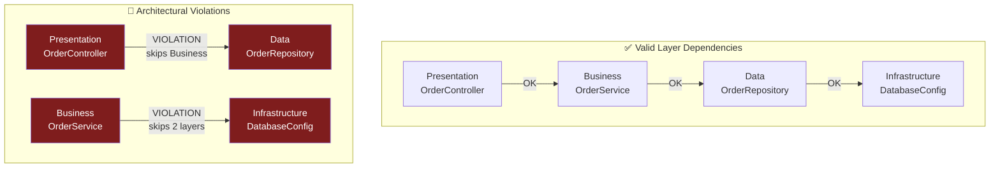

### Visual — Complete Graph 2 data structure

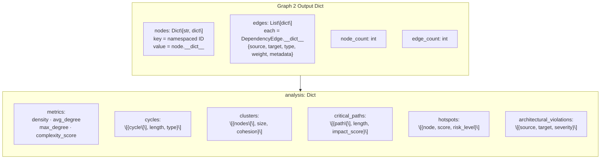

---

## Graph 3 — Context Builder Layer Graph

**What:** Directed layer-classification graph mapping files to architecture layers and classes to imports.
**Library:** Pure Python — `collections.defaultdict` only.
**Built** in Stage 3 (before agentic analysis), feeds transformer, validators, and audit report.

### Visual — Layer classification decision tree

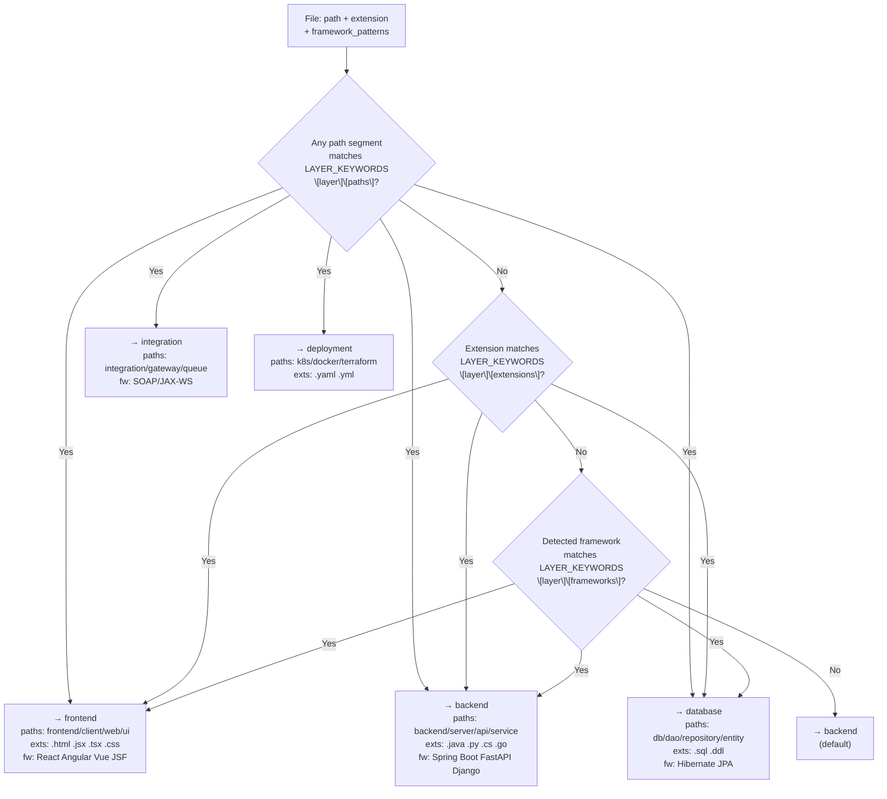

### Visual — Full layer graph with nodes and edges

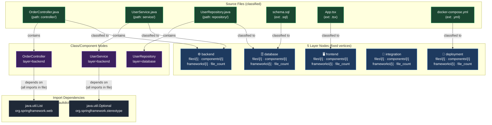

### Visual — Graph 3 final data structure

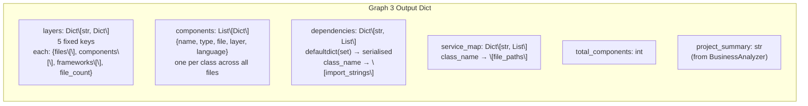

---

## Side-by-side visual comparison

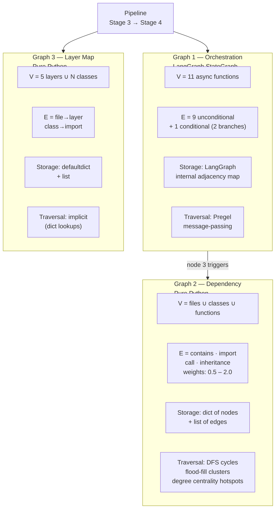

---

## Why all three are real graphs — G = (V, E)

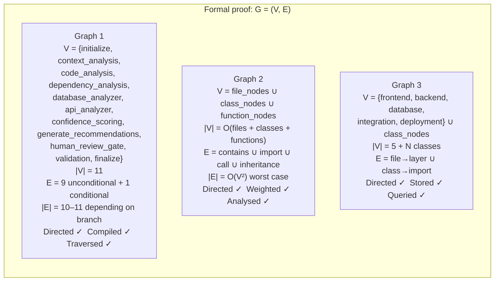
