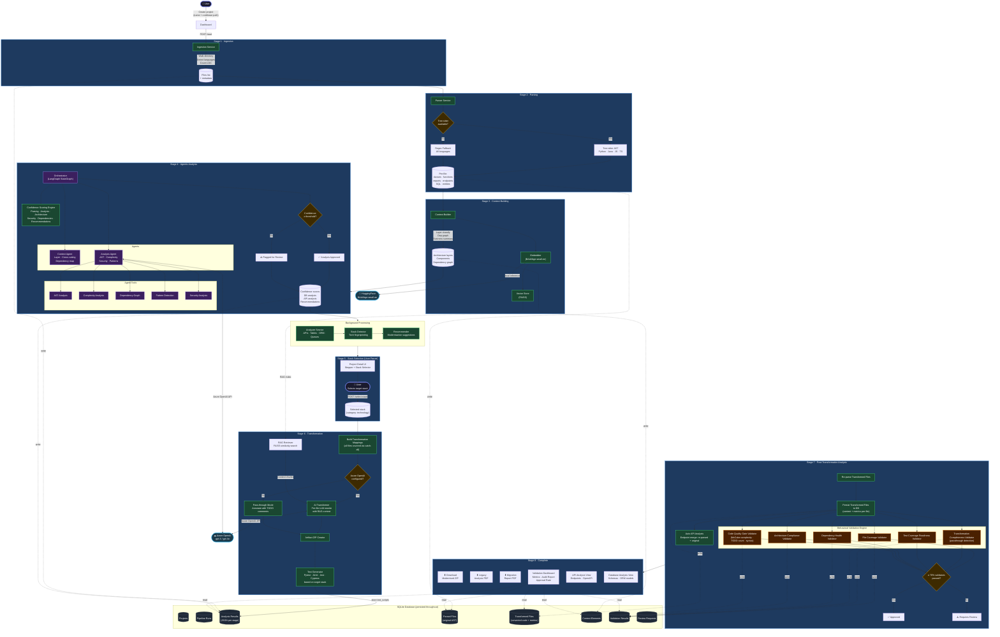

# CodeMorph — End-to-End Workflow

```mermaid
flowchart TD
    %% ── USER ENTRY ──────────────────────────────────────────────────────────
    USER(["👤 User"])

    USER -->|"Create project\n(name + codebase path)"| DASH["Dashboard"]
    DASH -->|"POST /start"| P1

    %% ── STAGE 1 ─────────────────────────────────────────────────────────────
    subgraph STAGE1["Stage 1 · Ingestion"]
        P1["Ingestion Service"]
        P1 -->|"Walk directory\nDetect languages\nCount LOC"| P1_OUT[("Files list\n+ metadata")]
    end

    %% ── STAGE 2 ─────────────────────────────────────────────────────────────
    subgraph STAGE2["Stage 2 · Parsing"]
        P2["Parser Service"]
        P2_TS{"Tree-sitter\navailable?"}
        P2_AST["Tree-sitter AST\nPython · Java · JS · TS"]
        P2_RGX["Regex Fallback\nAll languages"]
        P2_OUT[("Per-file:\nclasses · functions\nimports · endpoints\nSQL · entities")]

        P2 --> P2_TS
        P2_TS -->|"Yes"| P2_AST
        P2_TS -->|"No"| P2_RGX
        P2_AST --> P2_OUT
        P2_RGX --> P2_OUT
    end

    %% ── STAGE 3 ─────────────────────────────────────────────────────────────
    subgraph STAGE3["Stage 3 · Context Building"]
        P3A["Context Builder"]
        P3B["Embedder\n(BAAI/bge-small-en)"]
        P3C["Vector Store\n(FAISS)"]
        P3A -->|"Layer classify\nDep graph\nBusiness summary"| P3_OUT[("Architecture layers\nComponents\nDependency graph")]
        P3A --> P3B --> P3C
    end

    %% ── STAGE 4 ─────────────────────────────────────────────────────────────
    subgraph STAGE4["Stage 4 · Agentic Analysis"]
        direction TB
        ORC["Orchestrator\n(LangGraph StateGraph)"]

        subgraph AGENTS["Agents"]
            CTX_AGT["Context Agent\nLayer · Cross-cutting\nDependency map"]
            ANA_AGT["Analysis Agent\nAST · Complexity\nSecurity · Patterns"]
        end

        subgraph AGENT_TOOLS["Agent Tools"]
            T_AST["AST Analysis"]
            T_CMPLX["Complexity Analysis"]
            T_DEP["Dependency Graph"]
            T_PAT["Pattern Detection"]
            T_SEC["Security Analysis"]
        end

        ORC --> CTX_AGT
        ORC --> ANA_AGT
        ANA_AGT --> T_AST & T_CMPLX & T_DEP & T_PAT & T_SEC

        ORC --> CNF["Confidence Scoring Engine\nParsing · Analysis · Architecture\nSecurity · Dependencies · Recommendations"]
        ORC --> HRG{"Confidence\n≥ threshold?"}
        HRG -->|"Yes"| APPROVED["✅ Analysis Approved"]
        HRG -->|"No"| REVIEW["⚠️ Flagged for Review"]
        APPROVED --> P4_OUT
        REVIEW --> P4_OUT
        P4_OUT[("Confidence scores\nDB analysis\nAPI analysis\nRecommendations")]
    end

    %% ── BACKGROUND ──────────────────────────────────────────────────────────
    subgraph BG["Background Processing"]
        ANA["Analyzer Service\nAPIs · Tables · ORM · Queues"]
        STK["Stack Detector\nTech fingerprinting"]
        REC["Recommender\nModernisation suggestions"]
        ANA --> STK --> REC
    end

    %% ── STAGE 5 ─────────────────────────────────────────────────────────────
    subgraph STAGE5["Stage 5 · Stack Selection  (User Pause)"]
        SEL["Project Detail UI\nStepper + Stack Selector"]
        USER2(["👤 User\nSelects target stack"])
        SEL --> USER2
        USER2 -->|"POST /select-stack"| SEL_OUT[("Selected stack\n{category: technology}")]
    end

    %% ── STAGE 6 ─────────────────────────────────────────────────────────────
    subgraph STAGE6["Stage 6 · Transformation"]
        MAP["Build Transformation Mappings\n(all files covered via catch-all)"]
        TRF_CHK{"Azure OpenAI\nconfigured?"}
        TRF_AI["AI Transformer\nPer-file LLM rewrite\nwith RAG context"]
        TRF_PT["Pass-through Mode\nAnnotate with TODO comments"]
        RAG["RAG Retriever\nFAISS similarity search"]
        ZIP["Artifact ZIP Creator"]

        MAP --> TRF_CHK
        TRF_CHK -->|"Yes"| TRF_AI
        TRF_CHK -->|"No"| TRF_PT
        RAG -->|"Context chunks"| TRF_AI
        TRF_AI --> ZIP
        TRF_PT --> ZIP

        TST["Test Generator\nPytest · JUnit · Jest · Cypress\nbased on target stack"]
        ZIP --> TST
    end

    %% ── STAGE 7 ─────────────────────────────────────────────────────────────
    subgraph STAGE7["Stage 7 · Post-Transformation Analysis"]
        direction TB
        REPARSE["Re-parse Transformed Files"]
        PERSIST["Persist Transformed Files to DB\n(content + metrics per file)"]
        API_AUTO["Auto API Analysis\nEndpoint merge: re-parsed + original"]

        subgraph VALIDATORS["Behavioral Validation Engine"]
            V1["File Coverage Validator"]
            V2["Transformation Completeness Validator\n(passthrough detection)"]
            V3["Test Coverage Readiness Validator"]
            V4["Dependency Health Validator"]
            V5["Architecture Compliance Validator"]
            V6["Code Quality Gate Validator\n(McCabe complexity · TODO count · syntax)"]
        end

        OVERALL{"≥ 70% validators\npassed?"}
        VAPPROVED["✅ Approved"]
        VREVIEW["⚠️ Requires Review"]

        REPARSE --> PERSIST
        PERSIST --> API_AUTO
        PERSIST --> V1 & V2 & V3 & V4 & V5 & V6
        V1 & V2 & V3 & V4 & V5 & V6 --> OVERALL
        OVERALL -->|"Yes"| VAPPROVED
        OVERALL -->|"No"| VREVIEW
    end

    %% ── COMPLETE ─────────────────────────────────────────────────────────────
    subgraph COMPLETE["Stage 8 · Complete"]
        direction LR
        DL_ZIP["⬇ Download\nModernised ZIP"]
        DL_LEG["⬇ Legacy\nAnalysis PDF"]
        DL_MIG["⬇ Migration\nReport PDF"]
        VAL_DASH["Validation Dashboard\nMetrics · Audit Report\nApproval Rate"]
        API_VIEW["API Analysis View\nEndpoints · OpenAPI"]
        DB_VIEW["Database Analysis View\nSchemas · ORM models"]
    end

    %% ── DATABASE (cross-cutting) ─────────────────────────────────────────────
    subgraph DATABASE["SQLite Database  (persisted throughout)"]
        direction LR
        DB1[("Projects")]
        DB2[("Pipeline Runs")]
        DB3[("Analysis Results\n(JSON per stage)")]
        DB4[("Parsed Files\n(original AST)")]
        DB5[("Transformed Files\n(converted code + metrics)")]
        DB6[("Context Elements")]
        DB7[("Validation Results")]
        DB8[("Review Requests")]
    end

    %% ── FLOW CONNECTIONS ─────────────────────────────────────────────────────
    P1_OUT --> P2
    P2_OUT --> P3A
    P3_OUT --> STAGE4
    P3C -.->|"RAG index"| RAG
    P4_OUT --> BG
    BG --> STAGE5
    SEL_OUT --> MAP
    TST -->|"store test_scripts"| DB3
    STAGE7 --> COMPLETE

    %% DB writes
    P1_OUT -.->|"write"| DB3
    P2_OUT -.->|"write"| DB4
    P3_OUT -.->|"write"| DB6
    P4_OUT -.->|"write"| DB3
    PERSIST -.->|"write"| DB5
    V1 & V2 & V3 & V4 & V5 & V6 -.->|"write"| DB7

    %% Audit reads
    VAL_DASH -.->|"read"| DB5
    VAL_DASH -.->|"read"| DB7
    VAL_DASH -.->|"read"| DB4
    VAL_DASH -.->|"read"| DB6
    VAL_DASH -.->|"read"| DB3

    %% External
    TRF_AI <-->|"Azure OpenAI API"| AZ(["☁ Azure OpenAI\ngpt-4 / gpt-4o"])
    ANA_AGT <-->|"Azure OpenAI API"| AZ
    P3B <-->|"local inference"| HF(["🤗 HuggingFace\nBAAI/bge-small-en"])

    %% Styling
    classDef stage fill:#1e3a5f,color:#fff,stroke:#4a90d9,stroke-width:2px
    classDef service fill:#1a4731,color:#fff,stroke:#4ade80,stroke-width:1.5px
    classDef agent fill:#3b1f5e,color:#fff,stroke:#a78bfa,stroke-width:1.5px
    classDef validator fill:#4a2000,color:#fff,stroke:#fb923c,stroke-width:1.5px
    classDef db fill:#1f2937,color:#fff,stroke:#6b7280,stroke-width:1px
    classDef ext fill:#1c3a4a,color:#fff,stroke:#38bdf8,stroke-width:1.5px
    classDef decision fill:#3d2a00,color:#fff,stroke:#fbbf24,stroke-width:1.5px
    classDef user fill:#1a1a2e,color:#fff,stroke:#818cf8,stroke-width:2px

    class STAGE1,STAGE2,STAGE3,STAGE4,STAGE5,STAGE6,STAGE7,COMPLETE stage
    class P1,P2,P3A,P3B,P3C,ANA,STK,REC,MAP,TRF_AI,TRF_PT,ZIP,TST,REPARSE,PERSIST,API_AUTO,CNF service
    class ORC,CTX_AGT,ANA_AGT,T_AST,T_CMPLX,T_DEP,T_PAT,T_SEC agent
    class V1,V2,V3,V4,V5,V6 validator
    class DB1,DB2,DB3,DB4,DB5,DB6,DB7,DB8 db
    class AZ,HF ext
    class P2_TS,TRF_CHK,HRG,OVERALL decision
    class USER,USER2 user
```
